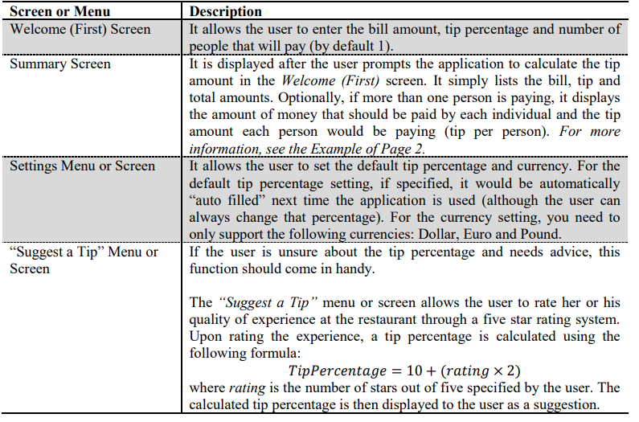
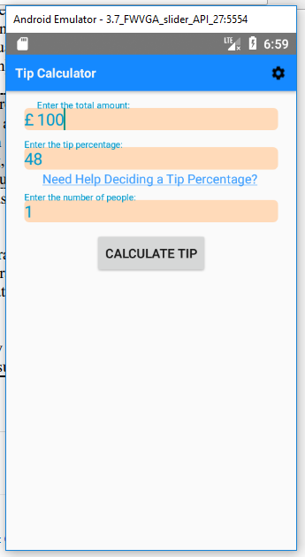
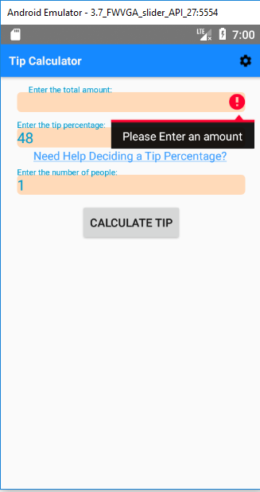
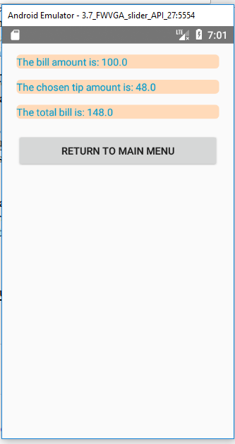
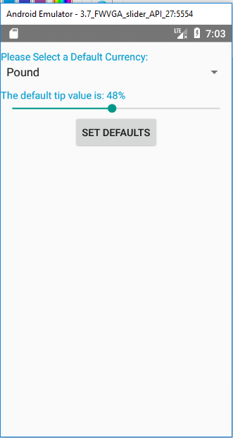
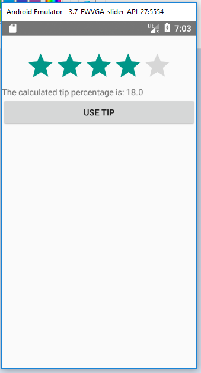

Tip calculator is an android application that calculates the tip amount to pay at a restaurant.

It has the following screens: 

Home With No Error screen:  

Home With Error Screen:  

Display Tip Screen:  

Set Settings Screen:  

Suggest Tip Screen:  
